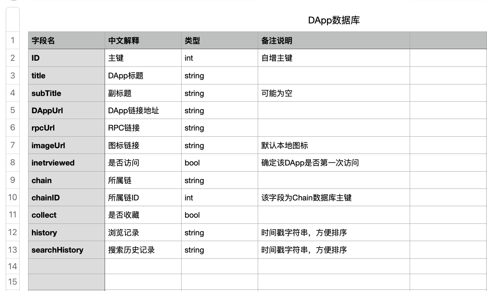

# WMDatabaseModules

- <font color=red>**数据库相关文档说明：**</font>

### Manager
- 该模块为数据库工具模块，基于微信开源数据库[**WCDB.swift**](https://github.com/Tencent/wcdb)封装。
- 目前封装简单增删改查、创建和删除数据表等方法

### Description
- 创建数据表的时候必须按照规定格式和要求来执行，统一管理。

#### Example -- DApp数据表
- 模型名称：采用模块名称+Database
  - Ex：`DAppDatabase`
- 表名："模块名称_table"
  - Ex：`DApp_table`
- 字段名：必须采用驼峰命名规则
  - 强调说明不能采用中文拼音，除特殊通用之外，Ex：taoBao
  - 必须附上字段名说明文档，统一存放在<font color=red>`Tables`</font>文件夹
  - 必须在模型顶部写上该表文档路径，方便查看字段描述

```
/// 字段详解见文档：https://github.com/Condy/Database/blob/master/Tables/DApp.numbers

public struct DAppDatabase: TableCodable {
    // 表名
    public static let DApp_table = "DApp_table"
    
    public var ID: Int?
    public var title: String?
    public var subTitle: String?
    ...
}
```

- 字段说明：


----

### Podspec
- 按模块分组，方便别的组件模块按需引入

```
s.subspec 'DApp' do |xx|
  xx.source_files = 'WMDatabaseModules/Classes/DApp/*.swift'
  xx.dependency 'WMDatabaseModules/Manager'
end
```
